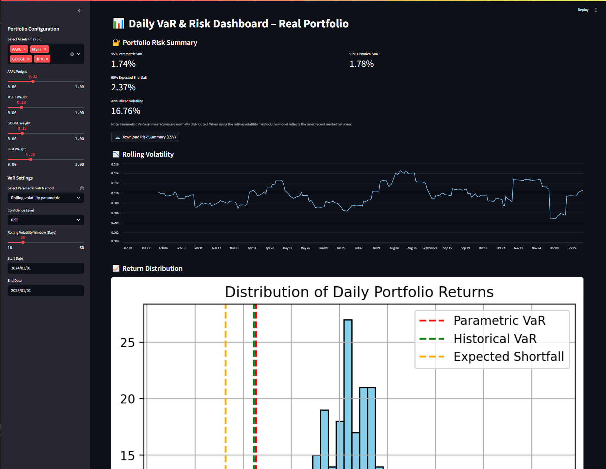
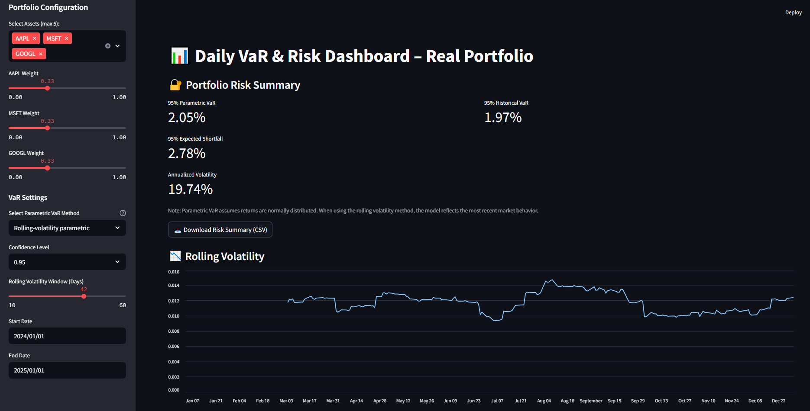
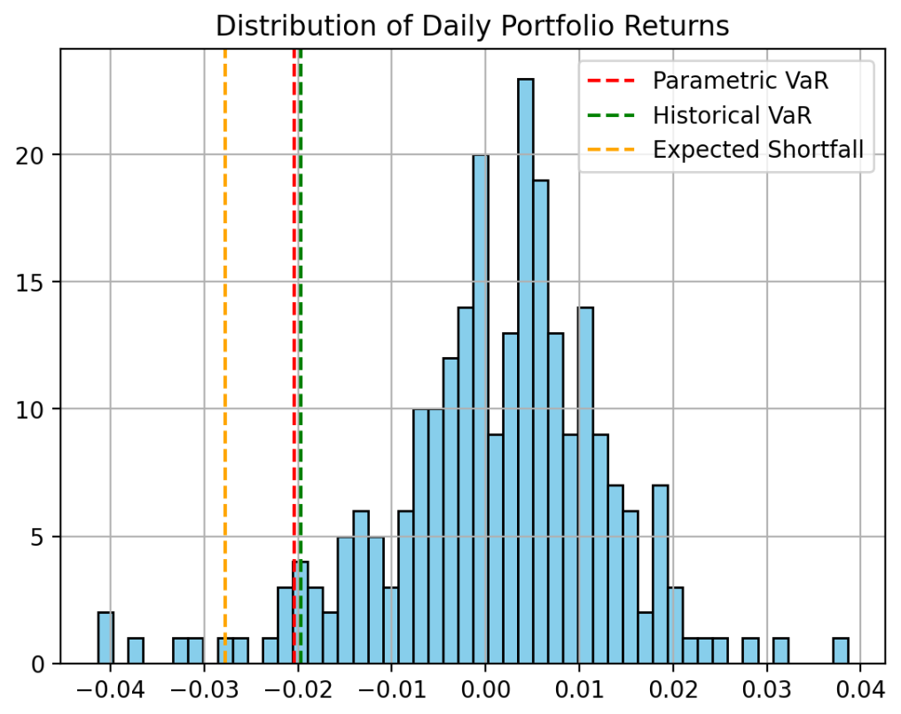

#  Daily VaR & Risk Dashboard

A streamlined, interactive Streamlit application for computing and visualizing portfolio Value-at-Risk (VaR), Expected Shortfall, and Volatility using real market data.

---

## Features


- Build a custom portfolio using real tickers (via Yahoo Finance)
- Choose between **Historical VaR** and **Parametric VaR**:
  - Full-window percentile (non-parametric)
  - Rolling-volatility parametric (normal distribution with z-score)
- Adjust:
  - Portfolio weights
  - Confidence level (95% or 99%)
  - Rolling volatility window
- View:
  - Risk metrics
  - Daily return distribution with VaR overlays
  - Rolling volatility chart
- Export a risk summary as a CSV

---


##  Key Risk Metrics

- **Value at Risk (VaR):** Estimates the maximum daily loss within a chosen confidence interval
- **Expected Shortfall (CVaR):** Average loss in worst-case scenarios beyond the VaR threshold
- **Annualized Volatility:** Normalized standard deviation of daily returns over the selected rolling window

>  Parametric VaR assumes returns are normally distributed. When using the rolling-volatility method, the model reflects recent market behavior.

## Dashboard Preview


*Full dashboard layout*


*Parametric and Historical VaR outputs*


*Portfolio return distribution with VaR overlay*

---

## Usage

```bash
# Step 1: Install dependencies
pip install -r requirements.txt

# Step 2: Run the dashboard
streamlit run app.py
```
